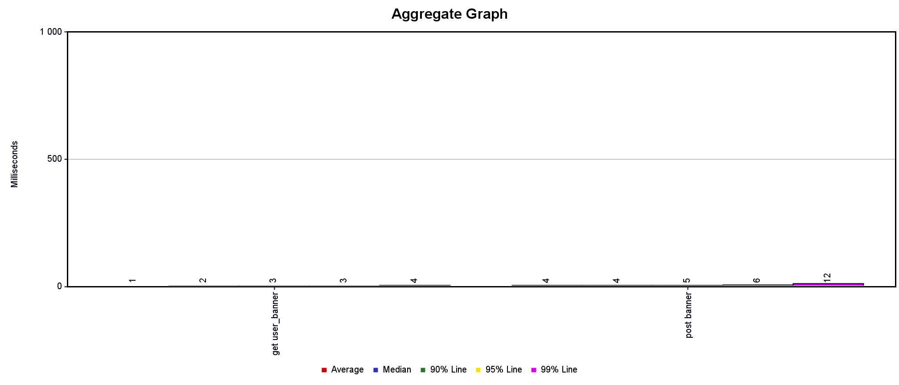

# Нагрузочное тестирование

Было проведено тестирование со следующими параметрами:
1) 600 запросов get user_banner со случайными параметрами от 1 до 1000
2) 600 запросов post banner со случайными параметрами
3) ramp-up period = 2s, loop count=2

Использовалось приложение Apache JMeter.

При RPS=1200 средняя задержка ответа составила 1 мс для get и 4 мс для post

Для 1% самых медленных: 4мс для get и 12мс для post

Таблица результата тестирования - [data.csv](data.csv)
Конфигурация тестирования - [user_banner.jmx](user_banner.jmx)